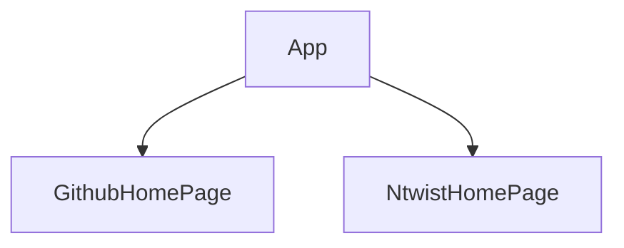

> 💻 PROJECT NAME ✨ => 💻FinMee Technology Assignment🧑‍💻 :-
 

## 🔗 Profile Links✨

| Resume | Github                                                                                                                                   | Linkedin                                                                                                                                                            | Portfolio                                                                                                                                    |
| ------------- | ---------------------------------------------------------------------------------------------------------------------------------------- | ------------------------------------------------------------------------------------------------------------------------------------------------------------------- | -------------------------------------------------------------------------------------------------------------------------------------------- |
|  | |  | |  

## 💫Tech-Stack->

- #### For Frontend:
   - `HTML5`
  - `CSS3`
  - `JavaScript `
  - `ReactJS`
    
- #### For Styling:-  
   - `Chakra UI `
   

- #### For live Project: -
   - `Vercel`
   

## ⭕Steps to run our project:

✨Clone the repository.

✨Run the command `npm install` in both the frontend and backend folders.

✨Run the command `npm start` in the frontend folder locally.

## ⭕Steps to use our project:
---
✨Project Overview:

This web application serves as a homepage designed as part of an assignment for Finmee's hiring process. 

---✨Getting Started:

✨Initialize the Application: To begin using the application, navigate to the frontend terminal and execute the command npm start. This will start the application locally, making it accessible through your web browser at port 3000.

✨Home Page: Upon launching the application, users are greeted with the home page with the best stayling  and responsiveness.

---
## Features ✨:-
---
 | Serial No            | Feature     |
| ----------------- | --------------- |
| 1 | HomePage of Github|
| 2 | HomePage of Ntwist|

---
# Package.json(Dependency)✨:-

 | Serial No        |  Frontend      |
| ----------------- | ---------------|
| 1 |  Chakra-ui |
| 2 | React Router dom |
| 3 | react-icons |
| 4 |chakraUi-icons||

---

## Flow

## ✨ Snapshot
 

 
---

<h1 align="center">✨Thank You✨</h1>

