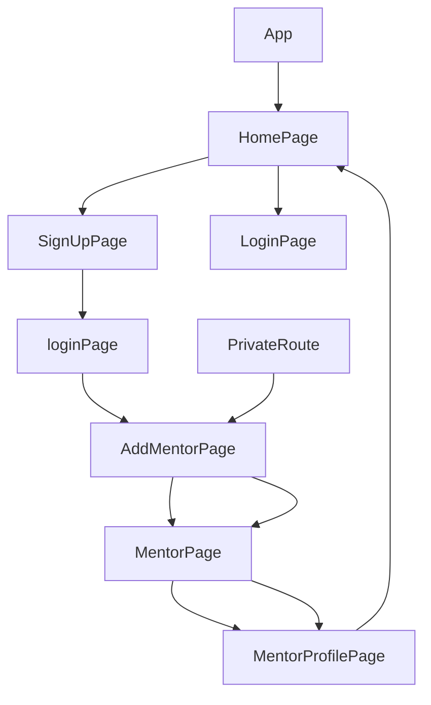

> 💻 PROJECT NAME ✨ => 💻FinMee Technology Assignment🧑‍💻 :-
 

## 🔗 Profile Links✨

| Resume | Github                                                                                                                                   | Linkedin                                                                                                                                                            | Portfolio                                                                                                                                    |
| ------------- | ---------------------------------------------------------------------------------------------------------------------------------------- | ------------------------------------------------------------------------------------------------------------------------------------------------------------------- | -------------------------------------------------------------------------------------------------------------------------------------------- |
|  | |  | |  

## 💫Tech-Stack->

- #### For Frontend:-
   - `HTML5`
  - `CSS3`
  - `JavaScript `
  - `ReactJS`
    
- #### For Styling:-  
   - `Chakra UI `
   

- #### For live Project: -
   - `Vercel`
   

## ⭕Steps to run our project:

✨Clone the repository.

✨Run the command `npm install` in both the frontend and backend folders.

✨Run the command `npm run server` in the backend folder.

## ⭕Steps to use our project:
---
✨Project Overview:

This web application serves as an appointment booking platform designed as part of an assignment for SkillTech's hiring process. The application streamlines the process of connecting users with mentors for guidance and assistance.

---✨Getting Started:

✨Initialize the Application: To begin using the application, navigate to the frontend terminal and execute the command npm start. This will start the application locally, making it accessible through your web browser at port 3000.

✨Home Page: Upon launching the application, users are greeted with the home page, offering essential options for interaction, and building that main image by themselves using 3d crystal illustrations and icons.

---✨User Journey:

💫Login and Signup: Users are provided with the choice to either log in to an existing account or sign up for a new one. This initial step ensures a personalized experience within the application.

✨Signup Process: New users must first complete the signup process, which collects essential information.

✨Login: After successfully signing up, users are redirected to the login page to authenticate themselves.

✨Add Mentor Profile: Following a successful login, users are taken to the "Add Mentor" page. Here, users have the opportunity to add themselves as mentors to the platform, enhancing its mentorship network.

✨Mentor List: Once the mentor profile setup is complete, users are directed to the "Mentor" page. This page lists all available mentors, allowing users to browse through their profiles.

✨View Mentor Profile: Users can select a mentor from the list and click on "View Mentor" to access a detailed mentor profile.

✨Book a Mentor: Within the mentor's profile, users can select a date and initiate the booking process. This feature streamlines the appointment scheduling process, making it convenient for users to secure mentorship sessions.

✨Confirmation and Return: Upon successfully booking a mentor, users are redirected to the home page, where they can explore further options. A logout feature is also accessible, ensuring user security.

---
## Features ✨:-
---
 | Serial No            | Feature                                                              |
| ----------------- | ------------------------------------------------------------------ |
| 1 | User signup and Login and logout |
| 2 | Home Page, Mentor page |
| 3 |Add Mentor Page, Mentor Profile page |
| 4 | navbar, footer, completely Responsive |
| 6 | light and dark mode |

---
# Package.json(Dependency)✨:-

 | Serial No            | Backend                      |  Frontend      |
| ----------------- | -------------------|------------------------ |
| 1 | bcrypt |   Chakra-ui |
| 2 | mongoose |  React Router dom |
| 3 | cors |    redux ,react-icons |
| 4 | dotenv |  react redux ,axios |
| 5 | express | chakraUi-icons |
| 6 | jsonwebtoken | redux thunk |

---

## Flow

## ✨ Snapshot
 

 
---

<h1 align="center">✨Thank You✨</h1>

